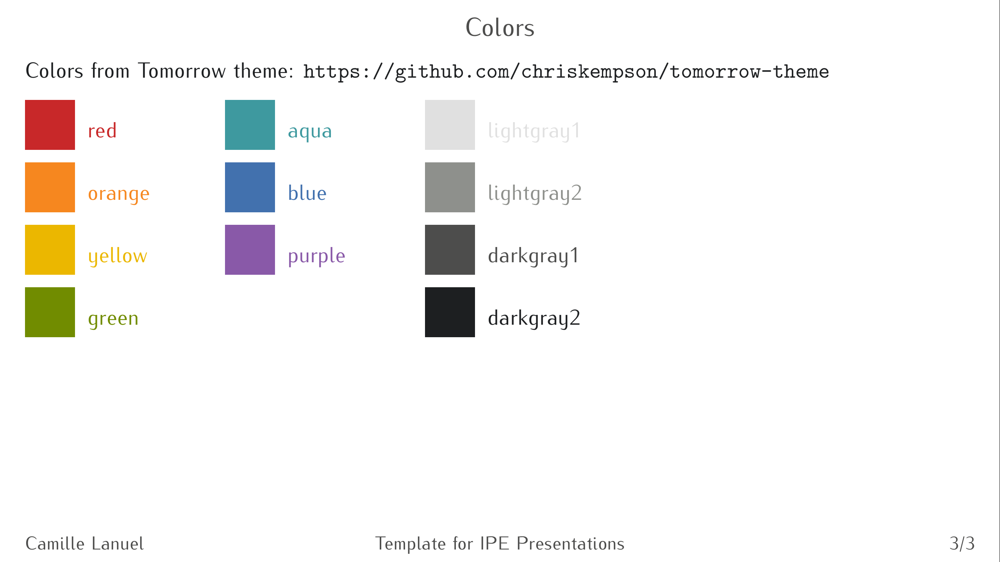

# Presentation

This repo contains the [Ipe](https://ipe.otfried.org/) style sheets that I used to create the figures in my PhD thesis and the presentation for my PhD defense.  I used the colors from Chris Kempson's [Tomorrow theme](https://github.com/chriskempson/tomorrow-theme).

The repo contains 4 files:

- **tomorrow_colors.isy**: colors from the Tomorrow theme;

- **tomorrow_presentation.isy**: presentation style sheet based on the Ipe presentation.isy style sheet, with the addition of Tomorrow's colors and an additional choice for opacity (20%);

- **TEMPLATE.pdf**: the base template for presentation

- **how_to_use.pdf**: instructions on how to use the template.



# LaTeX colors

If you want to use Tomorrow's colors in LaTeX, copy paste the following (and don't forget to use the `xcolor` package!).

```latex
\definecolor{tmw_red}{HTML}{C82829}
\definecolor{tmw_green}{HTML}{718C00}
\definecolor{tmw_yellow}{HTML}{EAB700}
\definecolor{tmw_orange}{HTML}{f5871f}
\definecolor{tmw_blue}{HTML}{4271AE}
\definecolor{tmw_purple}{HTML}{8959A8}
\definecolor{tmw_cyan}{HTML}{3E999F}
\definecolor{tmw_lightgray1}{HTML}{E0E0E0}
\definecolor{tmw_lightgray2}{HTML}{8E908C}
\definecolor{tmw_darkgray1}{HTML}{4D4D4C}
\definecolor{tmw_darkgray2}{HTML}{1D1F21}
```

# Thanks

Special thanks to Chris Kempson for the color theme and to [Oleg Soloviev](https://olejorik.github.io/post/ipe_presentation_template/) for the tutorial on how to create a presentation template in Ipe 😊
